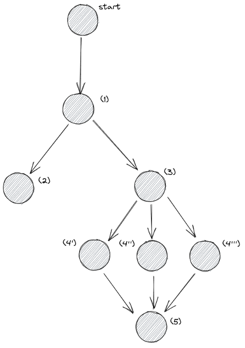

## Modular Structure of the project

- **Modular structure**: each task lives in its own file inside `dags/tasks/`
  for readability and easier testing.

- **Task 1**: cities and API key are stored as Airflow Variables (set via .env and in docker compose airflow-init service).

- **Tasks 2 & 3**: run in parallel after task 1 — they are independent of each other.
  Task 2 feeds the dashboard (last 20 files), Task 3 feeds the ML pipeline (all files).

- **Tasks 4a, 4b, 4c**: use a single generic function `train_and_evaluate_model()`
  with `op_kwargs` to pass different models — avoids code duplication.
  Scores are communicated via XCom.

- **Task 5**: pulls XCom scores from all 3 training tasks, selects the best model
  (highest neg_mean_squared_error = closest to 0), retrains on all data and saves.

## Pipeline flow

t1 → [t2, t3] \
t3 → [t4a, t4b, t4c] \
[t4a, t4b, t4c] → t5